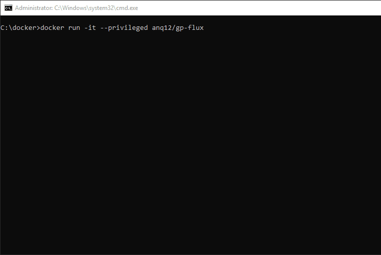
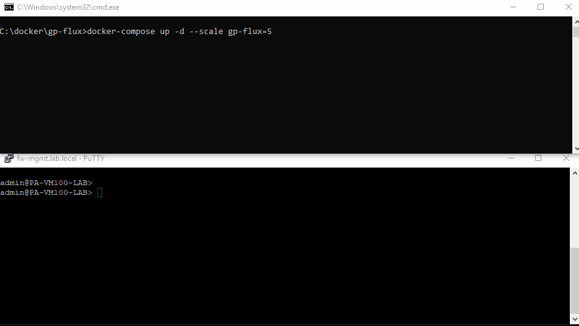
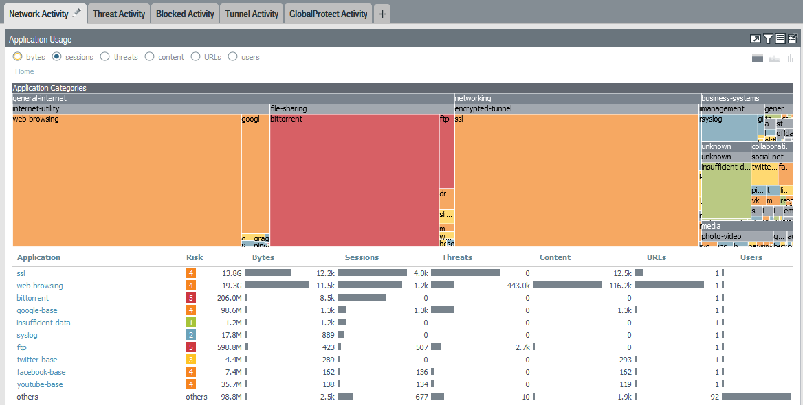
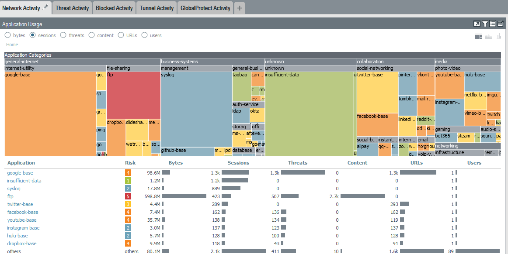

# gp-flux
Openconnect GlobalProtect client traffic generator. This image is designed for simulating real user network traffic and performing stability/throughput testing. Container will default run for 1 hour, can be changed with variable TIMEOUT=seconds.
Since the image uses Openconnect instead of the official GP software, a GlobalProtect Portal license is not required on firewall.

Getting started;

Single container, no client certificate:

docker run -it --privileged -e GP_USERNAME=CHANGE-ME -e GP_HOST=CHANGE-ME -e GP_PASSWORD=CHANGE-ME anq12/gp-flux

Single container, client certificate/key in C:\docker\certificates

docker run -it --privileged --mount type=bind,source="C:\docker\certificates",target=/opt/gp-flux/certificates -e GP_USERNAME=CHANGE-ME -e GP_HOST=CHANGE-ME -e GP_PASSWORD=CHANGE-ME anq12/gp-flux

10 containers, using docker-compose (variables in gp-flux.env file)

docker-compose up -d --scale gp-flux=10
when done, use docker-compose down

Notes / Requirements:
- Container can connect via GP Portal or directly to GP Gateway
- Self-signed / untrusted / internal CA-signed certificates _should_ all work 
- If multiple gateways are available from a portal, the first on the list will be used
- Decryption of traffic is supported if CA cert is installed (see certificates/Certificate Instructions.txt)
- X-Auth is _not_ required on gateway - Openconnect will emulate GP client
- Almost all actions can be switched on/off through ENV variables
- If run with docker-compose, username/password can be randomly selected from a .csv. Replace userlist.csv in example/ directory and set variable USERLIST to "true"

Default actions:
- Bittorrent (transmission-daemon) - 100KB/s up/down limit - 200 max peers. Torrent files are from academictorrents.com
- Noisy.py HTTP/HTTPS - top 250 sites - no adult sites (as per PANW URL category)
- nmap against GP-issued DNS servers (option to add additional networks)
- curl all PANDB category-example sites
- wget Bacon Ipsum, syslog result to 8.8.8.8
- wget FTP - 200KB/s limit
- wget EICAR test malware files
- youtube-dl a few files - 200 KB/s limit
- SMTP dummy files - swaks/smtpbucket

Troubleshooting:
- It's DNS.
- It's always DNS.

Examples:
Single instance using docker run

Multiple instances using docker-compose

ACC report ordered by sessions, 5 containers, running for two hours (DNS removed)

ACC report, same as above, but DNS/web-browsing/SSL/Bittorrent removed, to show more of the App-ID signatures recognized
